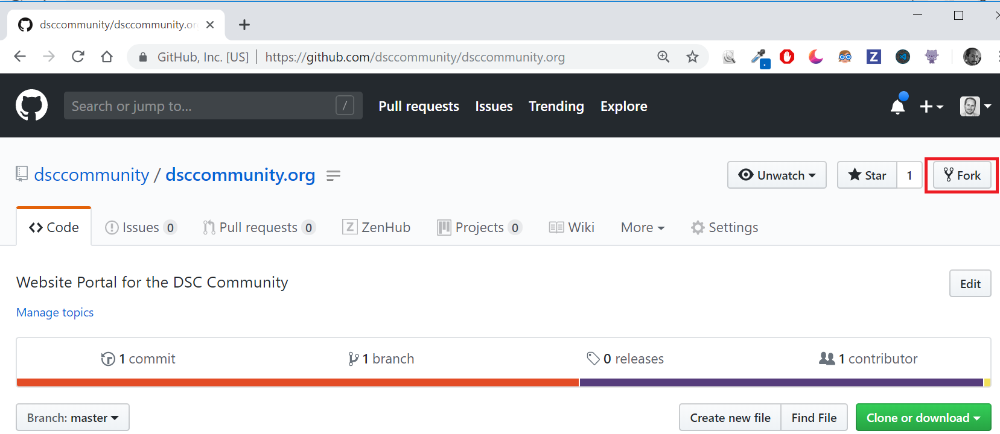
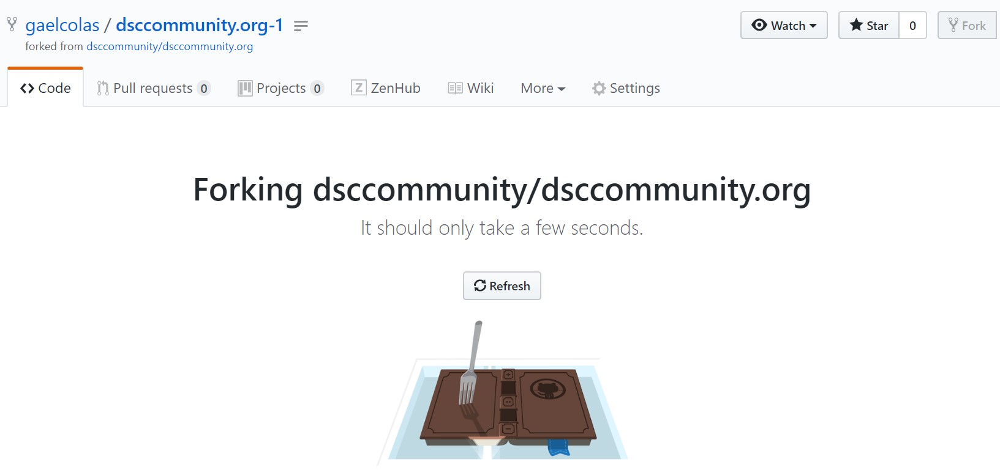

# DSC Community Website

This repository is the source of the (upcoming) DSC Community website: a portal for the DSC ecosystem to share its current work, news and practices.

The goal is to have a low-tech (static html from markdown) website, optimized for content, that help create and share content from the DSC Community, regardless of the solution and origin of tools leveraging DSC.

Doing so would improve the SEO (Search Engine Optimization), and make the different components of the DSC ecosystem more discoverable by its potential users, by providing a portal.

It is not meant to replace the [existing forums found on PowerShell.Org](https://powershell.org/forums/forum/dsc-desired-state-configuration/), the [instant messaging DSC channel on the PowerShell Slack](http://powershell.slack.com).

## Production Website

This DSC Community Organization is not official yet, and assuming no-one has strong objections with the current plan (emailed to maintainers on July 14th 2019), this should be official by the next DSC Community Call the 31st of July, latest.

## Contributing

### Getting Started

The website is a HUGO generated static website: it takes files in markdown format and assets to generate a static HTML website.

Make sure you install Hugo first, the easiest is with the Chocolatey Package Management:

```powerShell
C:\ > choco install hugo
```

Or you can use WinGet to install Hugo:

```powershell
winget install Hugo.Hugo --source winget
```

Then you can clone this website and run it. But we recommend you first fork the repository under your github account, and clone that fork before so you can create Pull Requests to contribute:



This will start the forking process:



When done you can find the git url under "Clone or download" button.
For my example it is: `git@github.com:gaelcolas/dsccommunity.org.git`

>If you are using HTTPS instead of SSH, then you can use the URL
>`https://github.com/gaelcolas/dsccommunity.org`.

I can now clone my fork:

```PowerShell
C:\src > git clone git@github.com:gaelcolas/dsccommunity.org.git

C:\src > cd .\dsccommunity.org\

C:\src\dsccommunity.org >

# Let's look at the remotes
C:\src\dsccommunity.org > git remote -v

origin  git@github.com:gaelcolas/dsccommunity.org.git (fetch)
origin  git@github.com:gaelcolas/dsccommunity.org.git (push)
```

On the master repository (dsccommunity/dsccommunity.org), not your personal fork, find the git url. It's this one: [git@github.com:dsccommunity/dsccommunity.org.git](git@github.com:dsccommunity/dsccommunity.org.git).

Now add this url as a new remote called upstream.

```PowerShell
# We should add an upstream remote, so we can push changes from the main repository:

C:\src\dsccommunity.org > git remote add upstream git@github.com:dsccommunity/dsccommunity.org.git

# now you can see the origin (your fork's remote) and the upstream (main repository's remote) configured

C:\src\dsccommunity.org > git remote -v
git remote -v
origin  git@github.com:gaelcolas/dsccommunity.org.git (fetch)
origin  git@github.com:gaelcolas/dsccommunity.org.git (push)
upstream        git@github.com:dsccommunity/dsccommunity.org.git (fetch)
upstream        git@github.com:dsccommunity/dsccommunity.org.git (push)
```

### Preparing for a change

When you need to make changes to the repository, make sure you always follow this process:

```PowerShell
# Move to your local master branch.
C:\src\dsccommunity.org > git checkout master

# Pull the latest changes from the DscCommunity master branch to your local master.
C:\src\dsccommunity.org > git pull --rebase upstream master

# Push the latest changes from upstream master to origin master.
C:\src\dsccommunity.org > git push origin master

# Make sure you never make change directly to your master. Create a new local branch called "newbranchname"
C:\src\dsccommunity.org > git checkout -b newbranchname

# Make the changes to your local branch, then add and commit.
C:\src\dsccommunity.org > git add .
C:\src\dsccommunity.org > git commit -m "added things"

# Push your changes to your personal fork on github, and track your local/newbranchname with origin/newbranchname.
C:\src\dsccommunity.org > git push -u origin newbranchname

# If changes have been merged to upstream master while you are working on your origin newbranchname,
# you should rebase your work asap to resolve conflicts early.
C:\src\dsccommunity.org > git pull --rebase upstream master

# Resolve conflicts and git rebase --continue as instructed on your screen

# Then you'll need to force update your branch on your private fork
C:\src\dsccommunity.org > git push --force

# When you're happy with your branch in your personal github fork, you can submit a pull request through the
# GitHub GUI, e.g. browse to https://github.com/<github_username>/dsccommunity.org/tree/newbranchname

# Once your PR has been merged, you can delete your local branch.
C:\src\dsccommunity.org > git checkout master
C:\src\dsccommunity.org > git branch -D newbranchname

# Once your PR has been merged, you can also delete the branch from your fork.
C:\src\dsccommunity.org > git push origin :newbranchname

# Then make sure you start again from beginning, pulling your changes from Upstream Master to your local
master, before pushing to your origin master (your private fork).

# Again, try to always avoid base a pull request on your private origin/master.
```

### Running the website locally

Now that you have HUGO installed, and you have the clone of your personal fork locally, you can run the Hugo server.

>_This website requires Hugo version `0.148.2` or higher. You can see the version_
>_by running `hugo version`._

```PowerShell
C:\src\dsccommunity.org > hugo server
```

You should now be able to browse the website on [http://localhost:1313](http://localhost:1313).

## Information update

### Resource modules

To update the [list of resource modules](https://dsccommunity.org/resources/)
some steps need to be run manually.

1. Update the file [`resources.json`](https://github.com/dsccommunity/dsccommunity.org/blob/master/data/resources.json).
   This list contains the names of the resource modules in the PowerShell Gallery
   to include in the list.
1. In the local repository folder run the following:
   ```powershell
   . .\Get-DscResourceKitInfo.ps1
   Get-DscResourceKitInfo -ExportTo (Join-Path -Path $PWD -ChildPath 'data/en/resources.json') -Verbose
   ```

>**NOTE**: The script requires PowerShellGet version 2.1.3 or higher.
>For example PowerShell Core 6.2.3 or better.

### Update maintainers

To update the list of maintainers, change the file [`maintainers.json`](https://github.com/dsccommunity/dsccommunity.org/blob/master/data/maintainers.json).
